# Hey, I'm Alper 👋

Computer Engineering senior building AI agents and ML-powered systems.

I focus on understanding systems from the ground up — from implementing models (NumPy GPT) to building end-to-end agent pipelines.

---

## 📊 GitHub Stats

  
  

---

## Stack

**Core**
Python · PyTorch · Transformers · NumPy

**AI Systems**
LLM Systems · Agentic Workflows · Fine-tuning · RAG

**Other**
React Native · TypeScript · Docker

---

## Featured Projects

### 🧠 [Numpy-GPT](https://github.com/Jessitoii/numpy-gpt)

Implemented a GPT-style transformer from scratch using only NumPy and CuPy (no PyTorch, no Hugging Face).
Includes tokenization, attention mechanism, and full training loop.

---

### 🧠 [ClinicaEye-NLP](https://github.com/Jessitoii/ClinicaEye-NLP)

BioBERT-based NLP model for ophthalmology disease classification.
Fine-tuned with focal loss to handle class imbalance.

---

### 📱 [OpenReef *(in progress)*](https://github.com/Jessitoii/numpy-gpt)

Privacy-first, fully offline AI agent for mobile devices.
Built with Flutter and on-device LLM inference.

---

### 🎵 [CNN Genre Classification (FMA)](https://github.com/Jessitoii/cnn-based-genre-recognition-fma)

Music genre classification using CNN + Mel-Spectrograms on the FMA dataset.

---

## Currently

* Building AI-powered mobile apps
* Improving ML fundamentals and system design

---

## Goal

Looking for **Junior AI/ML / LLM Systems roles**

---

## Contact

📫 [alpercanzerr1600@gmail.com](mailto:alpercanzerr1600@gmail.com)
🔗 LinkedIn: https://www.linkedin.com/in/alper-can-%C3%B6zer-7bbbba247/
